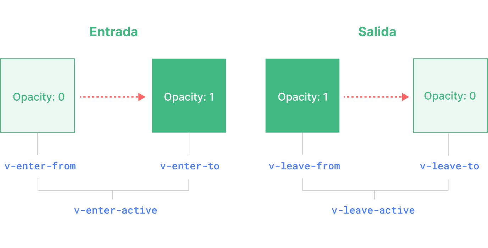

<script setup>
import Basic from './transition-demos/Basic.vue'
import SlideFade from './transition-demos/SlideFade.vue'
import CssAnimation from './transition-demos/CssAnimation.vue'
import NestedTransitions from './transition-demos/NestedTransitions.vue'
import JsHooks from './transition-demos/JsHooks.vue'
import BetweenElements from './transition-demos/BetweenElements.vue'
import BetweenComponents from './transition-demos/BetweenComponents.vue'
</script>

# Transition {#transition}

Vue ofrece dos componentes incorporados que pueden ayudar a trabajar con transiciones y animaciones en respuesta al cambio de estado:

- `<Transition>` para aplicar animaciones cuando un elemento o componente entra y sale del DOM. Esto se cubre en esta página.

- `<TransitionGroup>` para aplicar animaciones cuando un elemento o componente es insertado, eliminado o movido dentro de una lista`v-for`. Esto se cubre en [el siguiente capítulo](/guide/built-ins/transition-group).

Ademas de estos dos componentes, también podemos aplicar animaciones en Vue usando otras técnicas como alternar clases CSS o animaciones impulsadas por el estado a través de enlaces de estilo. Estas técnicas adicionales se tratan en el capítulo [Técnicas de animación](/guide/extras/animation).

## El Componente `<Transition>` {#the-transition-component}

`<Transition>` es un componente integrado: esto significa que está disponible en la plantilla de cualquier componente sin tener que registrarlo. Se puede utilizar para aplicar animaciones de entrada y salida en elementos o componentes pasados a través de un slot por defecto. La entrada o salida puede ser activada por una de las siguientes opciones:

- Renderizado condicional mediante `v-if`.
- Visualización condicional mediante `v-show`.
- Alternancia de componentes dinámicos a través del elemento especial `<component>`.
- Cambiando el atributo especial `key`:

Este es un ejemplo del uso más básico:

```vue-html
<button @click="show = !show">Alternar</button>
<Transition>
  <p v-if="show">Hola</p>
</Transition>
```

```css
/* ¡explicaremos lo que hacen estas clases a continuación! */
.v-enter-active,
.v-leave-active {
  transition: opacity 0.5s ease;
}

.v-enter-from,
.v-leave-to {
  opacity: 0;
}
```

<Basic />

<div class="composition-api">

[Pruébalo en la Zona de Práctica](https://play.vuejs.org/#eNpVkEFuwyAQRa8yZZNWqu1sunFJ1N4hSzYUjRNUDAjGVJHluxcCipIV/OG/pxEr+/a+TwuykfGogvYEEWnxR2H17F0gWCHgBBtMwc2wy9WdsMIqZ2OuXtwfHErhlcKCb8LyoVoynwPh7I0kzAmA/yxEzsKXMlr9HgRr9Es5BTue3PlskA+1VpFTkDZq0i3niYfU6anRmbqgMY4PZeH8OjwBfHhYIMdIV1OuferQEoZOKtIJ328TgzJhm8BabHR3jeC8VJqusO8/IqCM+CnsVqR3V/mfRxO5amnkCPuK5B+6rcG2fydshks=)

</div>
<div class="options-api">

[Pruébalo en la Zona de Práctica](https://play.vuejs.org/#eNpVkMFuAiEQhl9lyqlNuouXXrZo2nfwuBeKs0qKQGBAjfHdZZfVrAmB+f/M/2WGK/v1vs0JWcdEVEF72vQWz94Fgh0OMhmCa28BdpLk+0etAQJSCvahAOLBnTqgkLA6t/EpVzmCP7lFEB69kYRFAYi/ROQs/Cij1f+6ZyMG1vA2vj3bbN1+b1Dw2lYj2yBt1KRnXRwPudHDnC6pAxrjBPe1n78EBF8MUGSkixnLNjdoCUMjFemMn5NjUGacnboqPVkdOC+Vpgus2q8IKCN+T+suWENwxyWJXKXMyQ5WNVJ+aBqD3e6VSYoi)

</div>

:::tip
`<Transition>` sólo admite un único elemento o componente como contenido del slot. Si el contenido es un componente, el componente también debe tener un único elemento raíz.
:::

Cuando se inserta o elimina un elemento en un componente `<Transition>`, esto es lo que sucede:

1. Vue detectará automáticamente si el elemento de destino tiene transiciones o animaciones CSS aplicadas. Si las tiene, se añadirá/eliminará un número de [clases de transición CSS](#clases-de-transicion) en los momentos adecuados.

2. Si hay escuchadores para [hooks de JavaScript](#hooks-de-javascript), estos hooks serán llamados en los momentos apropiados.

3. Si no se detectan transiciones / animaciones CSS y no se proporcionan hooks de JavaScript, las operaciones del DOM para la inserción y/o eliminación se ejecutarán en el siguiente frame de animación del navegador.

## Transiciones Basadas en CSS {#css-based-transitions}

### Clases de Transición {#transition-classes}

Hay seis clases aplicadas para las transiciones de entrada/salida.



<!-- https://www.figma.com/file/rlOv0ZKJFFNA9hYmzdZv3S/Transition-Classes -->

1. `v-enter-from`: Estado inicial de la entrada. Se añade antes de que se inserte el elemento, se elimina un frame después de que se inserte el elemento.

2. `v-enter-active`: Estado activo para entrar. Se aplica durante toda la fase de entrada. Se añade antes de que se inserte el elemento, se elimina cuando termina la transición/animación. Esta clase se puede utilizar para definir la duración, el retardo y la curva de atenuación de la transición de entrada.

3. `v-enter-to`: Estado de finalización de la entrada. Se añade un frame después de la inserción del elemento (al mismo tiempo que se elimina el `v-enter-from`), se elimina cuando termina la transición/animación.

4. `v-leave-from`: Estado inicial para la salida. Se añade inmediatamente cuando se activa una transición de salida, se elimina después de un frame.

5. `v-leave-active`: Estado activo para la salida. Se aplica durante toda la fase de salida. Se añade inmediatamente cuando se activa una transición de salida, y se elimina cuando termina la transición/animación. Esta clase puede utilizarse para definir la duración, el retardo y la curva de atenuación de la transición de salida.

6. `v-leave-to`: Estado de finalización de la salida. Se añade un frame después de que se active una transición de salida (al mismo tiempo que se elimina `v-leave-from`), y se elimina cuando termina la transición/animación.

`v-enter-active` y `v-leave-active` nos dan la posibilidad de especificar diferentes curvas de atenuación para las transiciones de entrada/salida, de las que veremos un ejemplo en las siguientes secciones.

### Transiciones Asignadas {#named-transitions}

Una transición puede ser nombrada a través de la proposición `name`:

```vue-html
<Transition name="fade">
  ...
</Transition>
```

Para una transición asignada, sus clases de transición llevarán el prefijo de su nombre en lugar de `v`. Por ejemplo, la clase aplicada para la transición anterior será `fade-enter-active` en lugar de `v-enter-active`. El CSS para la transición de desvanecimiento debería tener este aspecto:

```css
.fade-enter-active,
.fade-leave-active {
  transition: opacity 0.5s ease;
}

.fade-enter-from,
.fade-leave-to {
  opacity: 0;
}
```

### Transiciones CSS {#css-transitions}

La propiedad `<Transition>` se utiliza más comúnmente en combinación con [transiciones CSS nativas](https://developer.mozilla.org/es/docs/Web/CSS/CSS_Transitions/Using_CSS_transitions), como se ve en el ejemplo básico anterior. La propiedad CSS `transition` es una abreviatura que nos permite especificar múltiples aspectos de una transición, incluyendo las propiedades que deben ser animadas, la duración de la transición y las [curvas de atenuación](https://developer.mozilla.org/en-US/docs/Web/CSS/easing-function).

Aquí hay un ejemplo más avanzado que transiciona múltiples propiedades, con diferentes duraciones y curvas de atenuación para entrar y salir:

```vue-html
<Transition name="slide-fade">
  <p v-if="show">hola</p>
</Transition>
```

```css
/*
  Las animaciones de entrada y salida pueden utilizar 
  diferentes duraciones y funciones de sincronización.
*/
.slide-fade-enter-active {
  transition: all 0.3s ease-out;
}

.slide-fade-leave-active {
  transition: all 0.8s cubic-bezier(1, 0.5, 0.8, 1);
}

.slide-fade-enter-from,
.slide-fade-leave-to {
  transform: translateX(20px);
  opacity: 0;
}
```

<SlideFade />

<div class="composition-api">

[Pruébalo en la Zona de Práctica](https://play.vuejs.org/#eNqFkc9uwjAMxl/F6wXQKIVNk1AX0HbZC4zDDr2E4EK0NIkStxtDvPviFQ0OSFzyx/m+n+34kL16P+lazMpMRBW0J4hIrV9WVjfeBYIDBKzhCHVwDQySdFDZyipnY5Lu3BcsWDCk0OKosqLoKcmfLoSNN5KQbyTWLZGz8KKMVp+LKju573ivsuXKbbcG4d3oDcI9vMkNiqL3JD+AWAVpoyadGFY2yATW5nVSJj9rkspDl+v6hE/hHRrjRMEdpdfiDEkBUVxWaEWkveHj5AzO0RKGXCrSHcKBIfSPKEEaA9PJYwSUEXPX0nNlj8y6RBiUHd5AzCOodq1VvsYfjWE4G6fgEy/zMcxG17B9ZTyX8bV85C5y1S40ZX/kdj+GD1P/zVQA56XStC9h2idJI/z7huz4CxoVvE4=)

</div>
<div class="options-api">

[Pruébalo en la Zona de Práctica](https://play.vuejs.org/#eNqFkc1uwjAMgF/F6wk0SmHTJNQFtF32AuOwQy+hdSFamkSJ08EQ776EbMAkJKTIf7I/O/Y+ezVm3HvMyoy52gpDi0rh1mhL0GDLvSTYVwqg4cQHw2QDWCRv1Z8H4Db6qwSyHlPkEFUQ4bHixA0OYWckJ4wesZUn0gpeainqz3mVRQzM4S7qKlss9XotEd6laBDu4Y03yIpUE+oB2NJy5QSJwFC8w0iIuXkbMkN9moUZ6HPR/uJDeINSalaYxCjOkBBgxeWEijnayWiOz+AcFaHNeU2ix7QCOiFK4FLCZPzoALnDXHt6Pq7hP0Ii7/EGYuag9itR5yv8FmgH01EIPkUxG8F0eA2bJmut7kbX+pG+6NVq28WTBTN+92PwMDHbSAXQhteCdiVMUpNwwuMassMP8kfAJQ==)

</div>

### Animaciones CSS {#css-animations}

Las [animaciones CSS nativas](https://developer.mozilla.org/es/docs/Web/CSS/CSS_Animations/Using_CSS_animations) se aplican de la misma manera que las transiciones CSS, con la diferencia de que `*-enter-from` no se elimina inmediatamente después de insertar el elemento, sino en un evento `animationend`.

Para la mayoría de las animaciones CSS, podemos simplemente declararlas bajo las clases `*-enter-active` y `*-leave-active`. He aquí un ejemplo:

```vue-html
<Transition name="bounce">
  <p v-if="show" style="text-align: center;">
    Hola, ¡aquí hay un texto animado!
  </p>
</Transition>
```

```css
.bounce-enter-active {
  animation: bounce-in 0.5s;
}
.bounce-leave-active {
  animation: bounce-in 0.5s reverse;
}
@keyframes bounce-in {
  0% {
    transform: scale(0);
  }
  50% {
    transform: scale(1.25);
  }
  100% {
    transform: scale(1);
  }
}
```

<CssAnimation />

<div class="composition-api">

[Pruébalo en la Zona de Práctica](https://play.vuejs.org/#eNqNksGOgjAQhl9lJNmoBwRNvCAa97YP4JFLbQZsLG3TDqzG+O47BaOezCYkpfB9/0wHbsm3c4u+w6RIyiC9cgQBqXO7yqjWWU9wA4813KH2toUpo9PKVEZaExg92V/YRmBGvsN5ZcpsTGGfN4St04Iw7qg8dkTWwF5qJc/bKnnYk7hWye5gm0ZjmY0YKwDlwQsTFCnWjGiRpaPtjETG43smHPSpqh9pVQKBrjpyrfCNMilZV8Aqd5cNEF4oFVo1pgCJhtBvnjEAP6i1hRN6BBUg2BZhKHUdvMmjWhYHE9dXY/ygzN4PasqhB75djM2mQ7FUSFI9wi0GCJ6uiHYxVsFUGcgX67CpzP0lahQ9/k/kj9CjDzgG7M94rT1PLLxhQ0D+Na4AFI9QW98WEKTQOMvnLAOwDrD+wC0Xq/Ubusw/sU+QL/45hskk9z8Bddbn)

</div>
<div class="options-api">

[Pruébalo en la Zona de Práctica](https://play.vuejs.org/#eNqNUs2OwiAQfpWxySZ66I8mXioa97YP4LEXrNNKpEBg2tUY330pqOvJmBBgyPczP1yTb2OyocekTJirrTC0qRSejbYEB2x4LwmulQI4cOLTWbwDWKTeqkcE4I76twSyPcaX23j4zS+WP3V9QNgZyQnHiNi+J9IKtrUU9WldJaMMrGEynlWy2em2lcjyCPMUALazXDlBwtMU79CT9rpXNXp4tGYGhlQ0d7UqAUcXOeI6bluhUtKmhEVhzisgPFPKpWhVCTUqQrt6ygD8oJQajmgRhAOnO4RgdQm8yd0tNzGv/D8x/8Dy10IVCzn4axaTTYNZymsSA8YuciU6PrLL6IKpUFBkS7cKXXwQJfIBPyP6IQ1oHUaB7QkvjfUdcy+wIFB8PeZIYwmNtl0JruYSp8XMk+/TXL7BzbPF8gU6L95hn8D4OUJnktsfM1vavg==)

</div>

### Clases para Transición Personalizadas {#custom-transition-classes}

También puedes especificar clases de transición personalizadas pasando las siguientes props a `<Transition>`:

- `enter-from-class`
- `enter-active-class`
- `enter-to-class`
- `leave-from-class`
- `leave-active-class`
- `leave-to-class`

Estas sobreescriben los nombres de clase convencionales. Esto es especialmente útil cuando se quiere combinar el sistema de transición de Vue con una biblioteca de animación CSS existente, como [Animate.css](https://daneden.github.io/animate.css/):

```vue-html
<¡ -- suponiendo que Animate.css está incluido en la página -->
<Transition
  name="custom-classes"
  enter-active-class="animate__animated animate__tada"
  leave-active-class="animate__animated animate__bounceOutRight"
>
  <p v-if="show">hola</p>
</Transition>
```

<div class="composition-api">

[Pruébalo en la Zona de Práctica](https://play.vuejs.org/#eyJBcHAudnVlIjoiPHNjcmlwdCBzZXR1cD5cbmltcG9ydCB7IHJlZiB9IGZyb20gJ3Z1ZSdcblxuY29uc3Qgc2hvdyA9IHJlZih0cnVlKVxuPC9zY3JpcHQ+XG5cbjx0ZW1wbGF0ZT5cblx0PGJ1dHRvbiBAY2xpY2s9XCJzaG93ID0gIXNob3dcIj5Ub2dnbGU8L2J1dHRvbj5cbiAgPFRyYW5zaXRpb25cbiAgICBuYW1lPVwiY3VzdG9tLWNsYXNzZXNcIlxuICAgIGVudGVyLWFjdGl2ZS1jbGFzcz1cImFuaW1hdGVfX2FuaW1hdGVkIGFuaW1hdGVfX3RhZGFcIlxuICAgIGxlYXZlLWFjdGl2ZS1jbGFzcz1cImFuaW1hdGVfX2FuaW1hdGVkIGFuaW1hdGVfX2JvdW5jZU91dFJpZ2h0XCJcbiAgPlxuICAgIDxwIHYtaWY9XCJzaG93XCI+aGVsbG88L3A+XG4gIDwvVHJhbnNpdGlvbj5cbjwvdGVtcGxhdGU+XG5cbjxzdHlsZT5cbkBpbXBvcnQgXCJodHRwczovL2NkbmpzLmNsb3VkZmxhcmUuY29tL2FqYXgvbGlicy9hbmltYXRlLmNzcy80LjEuMS9hbmltYXRlLm1pbi5jc3NcIjtcbjwvc3R5bGU+IiwiaW1wb3J0LW1hcC5qc29uIjoie1xuICBcImltcG9ydHNcIjoge1xuICAgIFwidnVlXCI6IFwiaHR0cHM6Ly9zZmMudnVlanMub3JnL3Z1ZS5ydW50aW1lLmVzbS1icm93c2VyLmpzXCJcbiAgfVxufSJ9)

</div>
<div class="options-api">

[Pruébalo en la Zona de Práctica](https://play.vuejs.org/#eNqNUcFuwjAM/RUvp+1Ao0k7sYDYF0yaOFZCJjU0LE2ixGFMiH9f2gDbcVKU2M9+tl98Fm8hNMdMYi5U0tEEXraOTsFHho52mC3DuXUAHTI+PlUbIBLn6G4eQOr91xw4ZqrIZXzKVY6S97rFYRqCRabRY7XNzN7BSlujPxetGMvAAh7GtxXLtd/vLSlZ0woFQK0jumTY+FJt7ORwoMLUObEfZtpiSpRaUYPkmOIMNZsj1VhJRWeGMsFmczU6uCOMHd64lrCQ/s/d+uw0vWf+MPuea5Vp5DJ0gOPM7K4Ci7CerPVKhipJ/moqgJJ//8ipxN92NFdmmLbSip45pLmUunOH1Gjrc7ezGKnRfpB4wJO0ZpvkdbJGpyRfmufm+Y4Mxo1oK16n9UwNxOUHwaK3iQ==)

</div>

### Uso Conjunto de Transiciones y Animaciones {#using-transitions-and-animations-together}

Vue necesita adjuntar escuchadores de eventos para saber cuándo ha terminado una transición. Estos pueden ser `transitionend` o `animationend`, dependiendo del tipo de reglas CSS aplicadas. Si sólo utilizas una u otra, Vue puede detectar automáticamente el tipo correcto.

Sin embargo, en algunos casos puedes querer tener ambos en el mismo elemento, por ejemplo, tener una animación CSS activada por Vue, junto con un efecto de transición CSS al pasar por encima. En estos casos, tendrás que declarar explícitamente el tipo que quieres que le interese a Vue pasando la proposición `type`, con un valor de `animation` o `transition`:

```vue-html
<Transition type="animation">...</Transition>

```

### Transiciones Anidadas y Duraciones de Transición Explícitas {#nested-transitions-and-explicit-transition-durations}

Aunque las clases de transición sólo se aplican al elemento hijo directo de `<Transition>`, podemos realizar transiciones en elementos anidados utilizando selectores CSS anidados:

```vue-html
<Transition name="nested">
  <div v-if="show" class="outer">
    <div class="inner">
      Hola
    </div>
  </div>
</Transition>
```

```css
/* reglas que apuntan a elementos anidados */
.nested-enter-active .inner,
.nested-leave-active .inner {
  transition: all 0.3s ease-in-out;
}

.nested-enter-from .inner,
.nested-leave-to .inner {
  transform: translateX(30px);
  opacity: 0;
}

/* ... se omite otro CSS necesario */
```

Incluso podemos añadir un retardo de transición al elemento anidado al entrar, lo que crea una secuencia de animación de entrada gradual:

```css{3}
/* retrasa la entrada del elemento anidado para un efecto gradual */
.nested-enter-active .inner {
  transition-delay: 0.25s;
}
```

Sin embargo, esto crea un pequeño problema. Por defecto, el componente `<Transition>` intenta averiguar automáticamente cuándo ha terminado la transición escuchando el **primer** evento `transitionend` o `animationend` del elemento de transición raíz. Con una transición anidada, el comportamiento deseado debería ser esperar hasta que las transiciones de todos los elementos internos hayan terminado.

En estos casos se puede especificar una duración explícita de la transición (en milisegundos) utilizando la propiedad `duration` del componente `<transition>`. La duración total debe coincidir con el retardo más la duración de la transición del elemento interno:

```vue-html
<Transition :duration="550">...</Transition>
```

<NestedTransitions />

[Pruébalo en la Zona de Práctica](https://play.vuejs.org/#eNqVVMtu2zAQ/JWtekjiRo80cIGoStCil3yADy2gC02tJCIUKZCUncDwv3cpyrbstmgLGxC53J2ZnaW0i772fbIZMMqjwnIjegcW3dA/lUp0vTYOdmCwhj3URndwRalXpSoV18pSaqu38OgTrp0Z8KZURRpQqJ42DrteMoe0AyjWg3NawRcuBX95LKOp+p1/ltHTSjeNxCINaaFkZZiywgkqqwbD/IIKl8usjECxDmmj0DqsqN4XUEklNrCJRT0RUCKXzFra6sGhOSZOqYdDodTpsHT+94xS6mNyStkHjuO6SE8KKVCks45pa92b9MtkpL6FZGSBHR26NeMvjdGDqnJ4j4ifPV7PqkqoJof7rH8dI51QcYuiaV0Od1mI7v0BoU5otAQ4g+Ocz9KCQzEq0hAz7sQGScoUlcg2OEWDMHfsKAcmJWTJvQVkFmOSQo0E5HQBFUr2BiMA6Jq0G6IAlNj55yI9UV+SAJxI4hEmJ5qPSxuwLzX7q3d7ieb0DKnWpsvD0rv/49r7dzMaqHvGhfMEB3CSvkXgTFF7Vs+kQCA4tGBhsDSMQ9RSmDtt7Flrc1en+f4i9ex0mtd/ujzSeJfPJf5NyuVE/9HsPzVCnp9wf2/995n16WK8ge6Z7iaw8XICg28tMSA8fIL10IBQ0DJVyZnR08RmFtkkvHirVligv9KOkrGiZKrXriVFa6O3Fmk62hwpHj7Als4QKMOzBZSWWVgjKqjFK1YjtLdxflWSLLsL9tAHbXyJo/1PJETL1g==)

Si es necesario, también puede especificar valores separados para las duraciones de entrada y salida utilizando un objeto:

```vue-html
<Transition :duration="{ enter: 500, leave: 800 }">...</Transition>
```

### Consideraciones sobre el Rendimiento {#performance-considerations}

Puedes observar que las animaciones mostradas anteriormente utilizan principalmente propiedades como `transform` y `opacity`. Estas propiedades son eficientes para animar porque:

1. No afectan al diseño del documento durante la animación, por lo que no activan el costoso cálculo del diseño CSS en cada frame de la animación.

2. La mayoría de los navegadores modernos pueden aprovechar la aceleración por hardware de la GPU al animar el `transform`.

En comparación, propiedades como `height` o `margin` activarán la maquetación CSS, por lo que son mucho más costosas de animar, y deben utilizarse con precaución. Podemos consultar recursos como [CSS-Triggers](https://csstriggers.com/) para ver qué propiedades activarán el maquetado si las animamos.

## Hooks de JavaScript {#javascript-hooks}

Podemos usar hooks en el proceso de transición con JavaScript escuchando los eventos del componente `<Transition>`:

```html
<Transition
  @before-enter="onBeforeEnter"
  @enter="onEnter"
  @after-enter="onAfterEnter"
  @enter-cancelled="onEnterCancelled"
  @before-leave="onBeforeLeave"
  @leave="onLeave"
  @after-leave="onAfterLeave"
  @leave-cancelled="onLeaveCancelled"
>
  <!-- ... -->
</Transition>
```

<div class="composition-api">

```js
// llamado antes de que el elemento se inserte en el DOM.
// Utiliza esto para establecer el estado de "entrada" del elemento
function onBeforeEnter(el) {}

// llamado de un frame después de que el elemento está insertado.
// usa esto para iniciar la animación de entrada.
function onEnter(el, done) {
  // llama al callback done para indicar el fin de la transición
  // opcional si se usa en combinación con CSS
  done()
}

// llamado cuando la transición de entrada ha terminado.
function onAfterEnter(el) {}
function onEnterCancelled(el) {}

// llamado antes del hook de salida.
// La mayoría de las veces, sólo debes usar el hook de salida
function onBeforeLeave(el) {}

// llamado cuando comienza la transición de salida.
// usa esto para iniciar la animación de salida.
function onLeave(el, done) {
  // llama al callback done para indicar el fin de la transición
  // opcional si se usa en combinación con CSS
  hecho()
}

// llamado cuando la transición de salida ha terminado y el
// elemento ha sido eliminado del DOM.
function onAfterLeave(el) {}

// sólo disponible con transiciones v-show
function onLeaveCancelled(el) {}
```

</div>
<div class="options-api">

```js
export default {
  // ...
  methods: {
    // llamado antes de que el elemento se inserte en el DOM.
    // Utiliza esto para establecer el estado de "entrada" del elemento
    onBeforeEnter(el) {}

    // llamado de un frame después de que el elemento está insertado.
    // usa esto para iniciar la animación de entrada.
    onEnter(el, done) {
      // llama al callback done para indicar el fin de la transición
      // opcional si se usa en combinación con CSS
      done()
    }

    // llamado cuando la transición de entrada ha terminado.
    onAfterEnter(el) {}
    onEnterCancelled(el) {}

    // llamado antes del hook de salida.
    // La mayoría de las veces, sólo debes usar el hook de salida
    onBeforeLeave(el) {}

    // llamado cuando comienza la transición de salida.
    // usa esto para iniciar la animación de salida.
    onLeave(el, done) {
      // llama al callback done para indicar el fin de la transición
      // opcional si se usa en combinación con CSS
      hecho()
    }

    // llamado cuando la transición de salida ha terminado y el
    // elemento ha sido eliminado del DOM.
    onAfterLeave(el) {}

    // sólo disponible con transiciones v-show
    onLeaveCancelled(el) {}
  }
}
```

</div>

Estos hooks pueden utilizarse en combinación con transiciones/animaciones de CSS o por sí solos.

Cuando se utilizan transiciones sólo JavaScript, suele ser una buena idea añadir la propiedad `:css="false"`. Esto le dice explícitamente a Vue que omita la detección automática de transiciones CSS. Además de ser un poco más eficiente, esto también evita que las reglas de CSS interfieran accidentalmente con la transición:

```vue-html{3}
<Transition
  ...
  :css="false"
>
  ...
</Transition>
```

Con `:css="false"`, también somos totalmente responsables de controlar cuándo termina la transición. En este caso, los callbacks `done` son necesarios para los hooks `@enter` y `@leave`. De lo contrario, los hooks serán llamados de forma sincrónica y la transición terminará inmediatamente.

Aquí hay una demostración que utiliza la [librería GreenSock](https://greensock.com/) para realizar las animaciones. Por supuesto, puedes usar cualquier otra librería de animación que quieras, por ejemplo [Anime.js](https://animejs.com/) o [Motion One](https://motion.dev/).

<JsHooks />

<div class="composition-api">

[Pruébalo en la Zona de Práctica](https://play.vuejs.org/#eNqNVMtu2zAQ/JUti8I2YD3i1GigKmnaorcCveTQArpQFCWzlkiCpBwHhv+9Sz1qKYckJ3FnlzvD2YVO5KvW4aHlJCGpZUZoB5a7Vt9lUjRaGQcnMLyEM5RGNbDA0sX/VGWpHnB/xEQmmZIWe+zUI9z6m0tnWr7ymbKVzAklQclvvFSG/5COmyWvV3DKJHTdQiRHZN0jAJbRmv9OIA432/UE+jODlKZMuKcErnx8RrazP8woR7I1FEryKaVTU8aiNdRfwWZTQtQwi1HAGF/YB4BTyxNY8JpaJ1go5K/WLTfhdg1Xq8V4SX5Xja65w0ovaCJ8Jvsnpwc+l525F2XH4ac3Cj8mcB3HbxE9qnvFMRzJ0K3APuhIjPefmTTyvWBAGvWbiDuIgeNYRh3HCCDNW+fQmHtWC7a/zciwaO/8NyN3D6qqap5GfVnXAC89GCqt8Bp77vu827+A+53AJrOFzMhQdMnO8dqPpMO74Yx4wqxFtKS1HbBOMdIX4gAMffVp71+Qq2NG4BCIcngBKk8jLOvfGF30IpBGEwcwtO6p9sdwbNXPIadsXxnVyiKB9x83+c3N9WePN9RUQgZO6QQ2sT524KMo3M5Pf4h3XFQ7NwFyZQpuAkML0doEtvEHhPvRDPRkTfq/QNDgRvy1SuIvpFOSDQmbkWTckf7hHsjIzjltkyhqpd5XIVNN5HNfGlW09eAcMp3J+R+pEn7L)

</div>
<div class="options-api">

[Pruébalo en la Zona de Práctica](https://play.vuejs.org/#eNqNVFFvmzAQ/is3pimNlABNF61iaddt2tukvfRhk/xiwIAXsJF9pKmq/PedDTSwh7ZSFLjvzvd9/nz4KfjatuGhE0ES7GxmZIu3TMmm1QahtLyFwugGFu51wRQAU+Lok7koeFcjPDk058gvlv07gBHYGTVGALbSDwmg6USPnNzjtHL/jcBK5zZxxQwZavVNFNqIHwqF8RUAWs2jn4IffCfqQz+mik5lKLWi3GT1hagHRU58aAUSshpV2YzX4ncCcbjZDp099GcG6ZZnEh8TuPR8S0/oTJhQjmQryLUSU0rUU8a8M9wtoWZTQtIwi0nAGJ/ZB0BwKxJYiJpblFko1a8OLzbhdgWXy8WzP99109YCqdIJmgifyfYuzmUzfFF2HH56o/BjAldx/BbRo7pXHKMjGbrl1IcciWn9fyaNfC8YsIueR5wCFFTGUVAEsEs7pOmDu6yW2f6GBW5o4QbeuScLbu91WdZiF/VlvgEtujdcWek09tx3qZ+/tXAzQU1mA8mCoeicneO1OxKP9yM+4ElmLaEFr+2AecVEn8sDZOSrSzv/1qk+sgAOa1kMOyDlu4jK+j1GZ70E7KKJAxRafKzdazi26s8h5dm+NLpTeQLvP27S6+urz/7T5aaUao26TWATt0cPPsgcK3f6Q1wJWVY4AVJtcmHWhueyo89+G38guD+agT5YBf39s25oIv5arehu8krYkLAs8BeG86DfuANYUCG2NomiTrX7Msx0E7ncl0bnXT04566M4PQPykWaWw==)

</div>

## Transiciones Reutilizables {#reusable-transitions}

Las transiciones pueden ser reutilizadas a través del sistema de componentes de Vue. Para crear una transición reutilizable, podemos crear un componente que envuelve el componente `<Transition>` y pasa el contenido del slot:

```vue{5}
<!-- MyTransition.vue -->
<script>
// lógica del hook de JavaScript...
</script>

<template>
  <!-- envolver el componente integrado Transition -->
  <Transition
    name="my-transition"
    @enter="onEnter"
    @leave="onLeave">
    <slot></slot> <!-- pasar el contenido del slot -->
  </Transition>
</template>

<style>
/*
  CSS necesario...
  Nota: evita el uso de <style scoped> aquí
  ya que no se aplica al contenido del slot.
*/
</style>
```

Ahora `MyTransition` puede importarse y utilizarse igual que la versión integrada:

```vue-html
<MyTransition>
  <div v-if="show">Hola</div>
</MyTransition>
```

## Transición al Aparecer {#transition-on-appear}

Si también quieres aplicar una transición en el renderizado inicial de un nodo, puedes añadir la prop `appear`:

```vue-html
<Transition appear>
  ...
</Transition>
```

## Transición Entre Elementos {#transition-between-elements}

Además de alternar un elemento con `v-if` / `v-show`, también podemos hacer una transición entre dos elementos utilizando `v-if` / `v-else` / `v-else-if`, siempre y cuando nos aseguremos de que sólo se está mostrando un elemento en cada momento:

```vue-html
<Transition>
  <button v-if="docState === 'saved'">Editar</button>
  <button v-else-if="docState === 'edited'">Guardar</button>
  <button v-else-if="docState === 'editing'">Cancelar</button>
</Transition>
```

<BetweenElements />

[Pruébalo en la Zona de Práctica](https://play.vuejs.org/#eNqdk8tu2zAQRX9loI0SoLLcFN2ostEi6BekmwLa0NTYJkKRBDkSYhj+9wxJO3ZegBGu+Lhz7syQ3Bd/nJtNIxZN0QbplSMISKNbdkYNznqCPXhcwwHW3g5QsrTsTGekNYGgt/KBBCEsouimDGLCvrztTFtnGGN4QTg4zbK4ojY4YSDQTuOiKwbhN8pUXm221MDd3D11xfJeK/kIZEHupEagrbfjZssxzAgNs5nALIC2VxNILUJg1IpMxWmRUAY9U6IZ2/3zwgRFyhowYoieQaseq9ElDaTRrkYiVkyVWrPiXNdiAcequuIkPo3fMub5Sg4l9oqSevmXZ22dwR8YoQ74kdsL4Go7ZTbR74HT/KJfJlxleGrG8l4YifqNYVuf251vqOYr4llbXz4C06b75+ns1a3BPsb0KrBy14Aymnerlbby8Vc8cTajG35uzFITpu0t5ufzHQdeH6LBsezEO0eJVbB6pBiVVLPTU6jQEPpKyMj8dnmgkQs+HmQcvVTIQK1hPrv7GQAFt9eO9Bk6fZ8Ub52Qiri8eUo+4dbWD02exh79v/nBP+H2PStnwz/jelJ1geKvk/peHJ4BoRZYow==)

## Modos de Transición {#transition-modes}

En el ejemplo anterior, los elementos que entran y salen se animan al mismo tiempo, y hemos tenido que hacerlos `position: absolute` para evitar el problema de diseño cuando ambos elementos están presentes en el DOM.

Sin embargo, en algunos casos esto no es una opción, o simplemente no es el comportamiento deseado. Podemos querer que el elemento que sale se anime primero, y que el elemento que entra sólo se inserte **después** de que la animación de salida haya terminado. Orquestar estas animaciones manualmente sería muy complicado; sin embargo, podemos habilitar este comportamiento pasándole a `<Transition>` una propiedad `mode`:

```vue-html
<Transition mode="out-in">
  ...
</Transition>
```

Aquí está la demostración anterior con `mode="out-in"`:

<BetweenElements mode="out-in" />

`<Transition>` también soporta `mode="in-out"`, aunque se utiliza con mucha menos frecuencia.

## Transición Entre Componentes {#transition-between-components}

`<Transition>` también puede utilizarse alrededor de [componentes dinámicos](/guide/essentials/component-basics#dynamic-components):

```vue-html
<Transition name="fade" mode="out-in">
  <component :is="activeComponent"></component>
</Transition>
```

<BetweenComponents />

<div class="composition-api">

[Pruébalo en la Zona de Práctica](https://play.vuejs.org/#eNqtksFugzAMhl/F4tJNKtDLLoxWKnuDacdcUnC3SCGJiMmEqr77EkgLbXfYYZyI8/v77dinZG9M5npMiqS0dScMgUXqzY4p0RrdEZzAfnEp9fc7HuEMx063sPIZq6viTbdmHy+yfDwF5K2guhFUUcBUnkNvcelBGrjTooHaC7VCRXBAoT6hQTRyAH2w2DlsmKq1sgS8JuEwUCfxdgF7Gqt5ZqrMp+58X/5A2BrJCcOJSskPKP0v+K8UyvQENBjcsqTjjdAsAZe2ukHpI3dm/q5wXPZBPFqxZAf7gCrzGfufDlVwqB4cPjqurCChFSjeBvGRN+iTA9afdE+pUD43FjG/bSHsb667Mr9qJot89vCBMl8+oiotDTL8ZsE39UnYpRN0fQlK5A5jEE6BSVdiAdrwWtAAm+zFAnKLr0ydA3pJDDt0x/PrMrJifgGbKdFPfCwpWU+TuWz5omzfVCNcfJJ5geL8pqtFn5E07u7fSHFOj6TzDyUDNEM=)

</div>
<div class="options-api">

[Pruébalo en la Zona de Práctica](https://play.vuejs.org/#eNqtks9ugzAMxl/F4tJNamGXXVhWqewVduSSgStFCkkUDFpV9d0XJyn9t8MOkxBg5/Pvi+Mci51z5TxhURdi7LxytG2NGpz1BB92cDvYezvAqqxixNLVjaC5ETRZ0Br8jpIe93LSBMfWAHRBYQ0aGms4Jvw6Q05rFvSS5NNzEgN4pMmbcwQgO1Izsj5CalhFRLDj1RN/wis8olpaCQHh4LQk5IiEll+owy+XCGXcREAHh+9t4WWvbFvAvBlsjzpk7gx5TeqJtdG4LbawY5KoLtR/NGjYoHkw+PTSjIqUNWDkwOK97DHUMjVEdqKNMqE272E5dajV+JvpVlSLJllUF4+QENX1ERox0kHzb8m+m1CEfpOgYYgpqVHOmJNpgLQQa7BOdooO8FK+joByxLc4tlsiX6s7HtnEyvU1vKTCMO+4pWKdBnO+0FfbDk31as5HsvR+Hl9auuozk+J1/hspz+mRdPoBYtonzg==)

</div>

## Transiciones Dinámicas {#dynamic-transitions}

¡Las props de `<Transition>` como `name` también pueden ser dinámicas! Esto nos permite aplicar transiciones diferentes de forma dinámica en función al cambio de estado:

```vue-html
<Transition :name="transitionName">
  <!-- ... -->
</Transition>
```

Esto puede ser útil cuando has definido transiciones / animaciones CSS utilizando las convenciones de clase de transition de Vue y quieres cambiar entre ellas.

También puedes aplicar diferentes comportamientos en los hooks transition de JavaScript basados en el estado actual de tu componente. Finalmente, la última forma de crear transiciones dinámicas es a través de [componentes de transición reutilizables](#transiciones-reutilizables) que aceptan props para cambiar la naturaleza de la(s) transición(es) a utilizar. Puede sonar cursi, pero el único límite realmente es tu imaginación.

---

**Relacionado**

- [Referencia de la API `<Transition>`](/api/built-in-components#transition)
