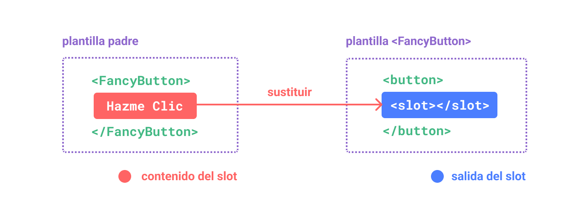
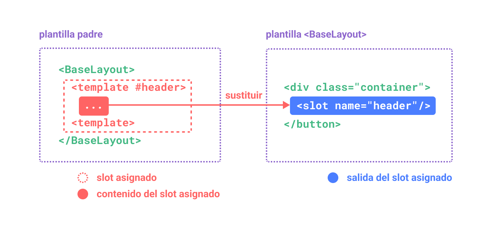
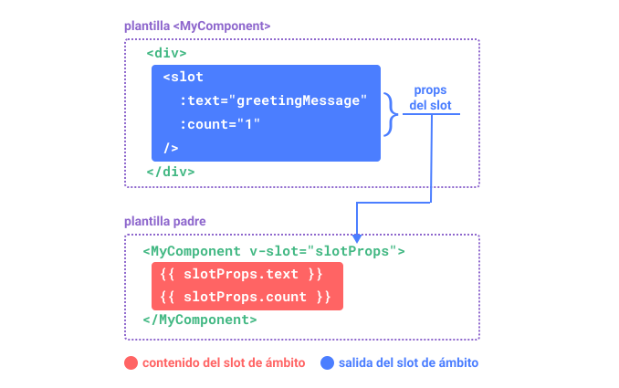

# Slots {#slots}

> Esta página supone que ya has leído los [Fundamentos de los Componentes](/guide/essentials/component-basics). Léelo primero si eres nuevo en el tema de componentes.

<VueSchoolLink href="https://vueschool.io/lessons/vue-3-component-slots" title="Lección gratuita de Slots de Vue.js"/>

## Contenido y Salida del Slot {#slot-content-and-outlet}

Ya aprendimos que los componentes pueden aceptar props, que pueden ser valores de JavaScript de cualquier tipo. Pero, ¿qué pasa con el contenido de las plantillas? Es posible que en algunos casos queramos pasar un fragmento de plantilla a un componente hijo, y dejar que el componente hijo renderice el fragmento dentro de su propia plantilla.

Por ejemplo, podemos tener un componente `<FancyButton>` que admite un uso como éste:

```vue-html{2}
<FancyButton>
  ¡Hazme clic! <!-- contenido del slot -->
</FancyButton>
```

La plantilla de `<FancyButton>` tiene el siguiente aspecto:

```vue-html{2}
<button class="fancy-btn">
  <slot></slot> <!-- salida del slot -->
</button>
```

El elemento `<slot>` es una **salida de slot** que indica dónde se debe renderizar el contenido del **slot** proporcionado por el padre.



<!-- https://www.figma.com/file/LjKTYVL97Ck6TEmBbstavX/slot -->

Y el renderizado final del DOM:

```html
<button class="fancy-btn">¡Hazme clic!</button>
```

<div class="composition-api">

[Pruébalo en la Zona de Práctica](https://play.vuejs.org/#eNpdUdlqAyEU/ZVbQ0kLMdNsXabTQFvoV8yLcRkkjopLSQj596oTwqRvnuM9y9UT+rR2/hs5qlHjqZM2gOch2m2rZW+NC/BDND1+xRCMBuFMD9N5NeKyeNrqphrUSZdA4L1VJPCEAJrRdCEAvpWke+g5NHcYg1cmADU6cB0A4zzThmYckqimupqiGfpXILe/zdwNhaki3n+0SOR5vAu6ReU++efUajtqYGJQ/FIg5w8Wt9FlOx+OKh/nV1c4ZVNqlHE1TIQQ7xnvCN13zkTNalBSc+Jw5wiTac2H1WLDeDeDyXrJVm9LWG7uE3hev3AhHge1cYwnO200L4QljEnd1bCxB1g82UNhe+I6qQs5kuGcE30NrxeaRudzOWtkemeXuHP5tLIKOv8BN+mw3w==)

</div>
<div class="options-api">

[Pruébalo en la Zona de Práctica](https://play.vuejs.org/#eNpdUdtOwzAM/RUThAbSurIbl1ImARJf0ZesSapoqROlKdo07d9x0jF1SHmIT+xzcY7sw7nZTy9Zwcqu9tqFTYW6ddYH+OZYHz77ECyC8raFySwfYXFsUiFAhXKfBoRUvDcBjhGtLbGgxNAVcLziOlVIp8wvelQE2TrDg6QKoBx1JwDgy+h6B62E8ibLoDM2kAAGoocsiz1VKMfmCCrzCymbsn/GY95rze1grja8694rpmJ/tg1YsfRO/FE134wc2D4YeTYQ9QeKa+mUrgsHE6+zC+vfjoz1Bdwqpd5iveX1rvG2R1GA0Si5zxrPhaaY98v5WshmCrerhVi+LmCxvqPiafUslXoYpq0XkuiQ1p4Ax4XQ2BSwdnuYP7p9QlvuG40JHI1lUaenv3o5w3Xvu2jOWU179oQNn5aisNMvLBvDOg==)

</div>

Con los slots, el `<FancyButton>` es responsable de renderizar el `<button>` exterior (y su estilo sofisticado), mientras que el contenido interior es proporcionado por el componente padre.

Otra forma de entender los slots es compararlos con las funciones de JavaScript:

```js
// el componente padre que pasa el contenido del slot
FancyButton('¡Hazme clic!')

// FancyButton renderiza el contenido del slot en su propia plantilla
function FancyButton(slotContent) {
  return `<button class="fancy-btn">
      ${slotContent}
    </button>`
}
```

El contenido del slot no se limita a texto. Puede ser cualquier contenido válido de una plantilla. Por ejemplo, podemos pasar múltiples elementos, o incluso otros componentes:

```vue-html
<FancyButton>
  <span style="color:red">¡Hazme clic!</span>
  <AwesomeIcon name="plus" />
</FancyButton>
```

<div class="composition-api">

[Pruébalo en la Zona de Práctica](https://play.vuejs.org/#eNp1UmtOwkAQvspQYtCEgrx81EqCJibeoX+W7bRZaHc3+1AI4QyewH8ewvN4Aa/gbgtNIfFf5+vMfI/ZXbCQcvBmMYiCWFPFpAGNxsp5wlkphTLwQjjdPlljBIdMiRJ6g2EL88O9pnnxjlqU+EpbzS3s0BwPaypH4gqDpSyIQVcBxK3VFQDwXDC6hhJdlZi4zf3fRKwl4aDNtsDHJKCiECqiW8KTYH5c1gEnwnUdJ9rCh/XeM6Z42AgN+sFZAj6+Ux/LOjFaEK2diMz3h0vjNfj/zokuhPFU3lTdfcpShVOZcJ+DZgHs/HxtCrpZlj34eknoOlfC8jSCgnEkKswVSRlyczkZzVLM+9CdjtPJ/RjGswtX3ExvMcuu6mmhUnTruOBYAZKkKeN5BDO5gdG13FRoSVTOeAW2xkLPY3UEdweYWqW9OCkYN6gctq9uXllx2Z09CJ9dJwzBascI7nBYihWDldUGMqEgdTVIq6TQqCEMfUpNSD+fX7/fH+3b7P8AdGP6wA==)

</div>
<div class="options-api">

[Pruébalo en la Zona de Práctica](https://play.vuejs.org/#eNptUltu2zAQvMpGQZEWsOzGiftQ1QBpgQK9g35oaikwkUiCj9aGkTPkBPnLIXKeXCBXyJKKBdoIoA/tYGd3doa74tqY+b+ARVXUjltp/FWj5GC09fCHKb79FbzXCoTVA5zNFxkWaWdT8/V/dHrAvzxrzrC3ZoBG4SYRWhQs9B52EeWapihU3lWwyxfPDgbfNYq+ejEppcLjYHrmkSqAOqMmAOB3L/ktDEhV4+v8gMR/l1M7wxQ4v+3xZ1Nw3Wtb8S1TTXG1H3cCJIO69oxc5mLUcrSrXkxSi1lxZGT0//CS9Wg875lzJELE/nLto4bko69dr31cFc8auw+3JHvSEfQ7nwbsHY9HwakQ4kes14zfdlYH1VbQS4XMlp1lraRMPl6cr1rsZnB6uWwvvi9hufpAxZfLryjEp5GtbYs0TlGICTCsbaXqKliZDZx/NpuEDsx2UiUwo5VxT6Dkv73BPFgXxRktlUdL2Jh6OoW8O3pX0buTsoTgaCNQcDjoGwk3wXkQ2tJLGzSYYI126KAso0uTSc8Pjy9P93k2d6+NyRKa)

</div>

Al usar slots, nuestro `<FancyButton>` es más flexible y reutilizable. Ahora podemos utilizarlo en diferentes lugares con diferentes contenidos internos, pero todos con el mismo diseño elegante.

El mecanismo de slots de los componentes de Vue está inspirado en el [elemento nativo de Componentes Web `<slot>`](https://developer.mozilla.org/en-US/docs/Web/HTML/Element/slot), pero con capacidades adicionales que veremos más adelante.

## Ámbito de Renderizado {#render-scope}

El contenido del slot tiene acceso al ámbito de datos del componente padre, porque está definido en el padre. Por ejemplo:

```vue-html
<span>{{ message }}</span>
<FancyButton>{{ message }}</FancyButton>
```

Aquí ambas interpolaciones <span v-pre>`{{ mensaje }}`</span> renderizarán el mismo contenido.

El contenido del slot **no** tiene acceso a los datos del componente hijo. Las expresiones en las plantillas de Vue sólo pueden acceder al ámbito en el que se define, de forma consistente con el léxico de ámbito de JavaScript. En otras palabras:

> Las expresiones en la plantilla padre sólo tienen acceso al ámbito padre; las expresiones en la plantilla hijo sólo tienen acceso al ámbito hijo.

## Contenido Alternativo {#fallback-content}

Hay casos en los que es útil especificar el contenido por defecto de un slot, que se mostrará sólo cuando no se proporcione ningún contenido. Por ejemplo, en un componente `<SubmitButton>`:

```vue-html
<button type="submit">
  <slot></slot>
</button>
```

Podemos querer que el texto "Submit" sea renderizado dentro del `<button>` si el padre no proporciona ningún contenido del slot. Para hacer que "Submit" sea el contenido alternativo, podemos colocarlo entre las etiquetas `<slot>`:

```vue-html{3}
<button type="submit">
  <slot>
    Enviar <!-- contenido alternativo -->
  </slot>
</button>
```

Ahora cuando usamos `<SubmitButton>` en un componente padre, no proporcionando contenido para el slot:

```vue-html
<SubmitButton />
```

Esto renderizará el contenido alternativo, "Enviar":

```html
<button type="submit">Enviar</button>
```

Pero si proporcionamos contenido:

```vue-html
<SubmitButton>Guardar</SubmitButton>
```

En ese caso, el contenido proporcionado se mostrará en su lugar:

```html
<button type="submit">Guardar</button>
```

<div class="composition-api">

[Pruébalo en la Zona de Práctica](https://play.vuejs.org/#eNp1kMsKwjAQRX9lzMaNbfcSC/oL3WbT1ikU8yKZFEX8d5MGgi2YVeZxZ86dN7taWy8B2ZlxP7rZEnikYFuhZ2WNI+jCoGa6BSKjYXJGwbFufpNJfhSaN1kflTEgVFb2hDEC4IeqguARpl7KoR8fQPgkqKpc3Wxo1lxRWWeW+Y4wBk9x9V9d2/UL8g1XbOJN4WAntodOnrecQ2agl8WLYH7tFyw5olj10iR3EJ+gPCxDFluj0YS6EAqKR8mi9M3Td1ifLxWShcU=)

</div>
<div class="options-api">

[Pruébalo en la Zona de Práctica](https://play.vuejs.org/#eNp1UEEOwiAQ/MrKxYu1d4Mm+gWvXChuk0YKpCyNxvh3lxIb28SEA8zuDDPzEucQ9mNCcRAymqELdFKu64MfCK6p6Tu6JCLvoB18D9t9/Qtm4lY5AOXwMVFu2OpkCV4ZNZ51HDqKhwLAQjIjb+X4yHr+mh+EfbCakF8AclNVkCJCq61ttLkD4YOgqsp0YbGesJkVBj92NwSTIrH3v7zTVY8oF8F4SdazD7ET69S5rqXPpnigZ8CjEnHaVyInIp5G63O6XIGiIlZMzrGMd8RVfR0q4lIKKV+L+srW+wNTTZq3)

</div>

## Slots Asignados {#named-slots}

Hay ocasiones en las que es útil tener varias salidas de slots en un mismo componente. Por ejemplo, en un componente `<BaseLayout>` con la siguiente plantilla:

```vue-html
<div class="container">
  <header>
    <!-- Queremos el contenido del header aquí -->
  </header>
  <main>
    <!-- Queremos el contenido del main aquí -->
  </main>
  <footer>
    <!-- Queremos el contenido del footer aquí -->
  </footer>
</div>
```

Para estos casos, el elemento `<slot>` tiene un atributo especial, `name`, que se puede utilizar para asignar un ID único a los diferentes slots y así poder determinar dónde se debe mostrar el contenido:

```vue-html
<div class="container">
  <header>
    <slot name="header"></slot>
  </header>
  <main>
    <slot></slot>
  </main>
  <footer>
    <slot name="footer"></slot>
  </footer>
</div>
```

Una salida de `<slot>` sin `nombre` tiene implícitamente el nombre "default".

En un componente padre que utilice `<BaseLayout>`, necesitamos una forma de pasar múltiples fragmentos de contenido del slot, cada uno dirigido a una salida de slot diferente. Aquí es donde entran en juego los **slots asignados**.

Para pasar un slot asignado, necesitamos usar un elemento `<template>` con la directiva `v-slot`, y luego pasar el nombre del slot como argumento a `v-slot`:

```vue-html
<BaseLayout>
  <template v-slot:header>
    <!-- contenido del slot header -->
  </template>
</BaseLayout>
```

`v-slot` tiene una abreviatura dedicada `#`, por lo que `<plantilla v-slot:header>` puede acortarse a sólo `<plantilla #header>`. Piensa en ello como "renderizar este fragmento de plantilla en el slot 'header' del componente hijo".



<!-- https://www.figma.com/file/2BhP8gVZevttBu9oUmUUyz/named-slot -->

Este es el código que pasa el contenido de los tres slots a `<BaseLayout>` utilizando la sintaxis abreviada:

```vue-html
<BaseLayout>
  <template #header>
    <h1>Aquí puede haber un título de página</h1>
  </template>

  <template #default>
    <p>Un párrafo para el contenido principal.</p>
    <p>Y otro más.</p>
  </template>

  <template #footer>
    <p>Aquí hay información de contacto</p>
  </template>
</BaseLayout>
```

Cuando un componente acepta tanto un slot por defecto como slots asignados, todos los nodos de nivel superior que no sean `<template>` son tratados implícitamente como contenido del slot default. Así que lo anterior también puede escribirse como:

```vue-html
<BaseLayout>
  <template #header>
    <h1>Aquí puede haber un título de página</h1>
  </template>

  <!-- slot default implícito -->
    <p>Un párrafo para el contenido principal.</p>
    <p>Y otro más.</p>

  <template #footer>
    <p>Aquí hay información de contacto</p>
  </template>
</BaseLayout>
```

Ahora todo lo que esté dentro de los elementos `<template>` se pasará a los slots correspondientes. El HTML final renderizado será:

```html
<div class="container">
  <header>
    <h1>Aquí puede haber un título de página</h1>
  </header>
  <main>
    <p>Un párrafo para el contenido principal.</p>
    <p>Y otro más.</p>
  </main>
  <footer>
    <p>Aquí hay información de contacto</p>
  </footer>
</div>
```

<div class="composition-api">

[Pruébalo en la Zona de Práctica](https://play.vuejs.org/#eNp9UsFuwjAM/RWrHLgMOi5o6jIkdtphn9BLSF0aKU2ixEVjiH+fm8JoQdvRfu/5xS8+ZVvvl4cOsyITUQXtCSJS5zel1a13geBdRvyUR9cR1MG1MF/mt1YvnZdW5IOWVVwQtt5IQq4AxI2cau5ccZg1KCsMlz4jzWrzgQGh1fuGYIcgwcs9AmkyKHKGLyPykcfD1Apr2ZmrHUN+s+U5Qe6D9A3ULgA1bCK1BeUsoaWlyPuVb3xbgbSOaQGcxRH8v3XtHI0X8mmfeYToWkxmUhFoW7s/JvblJLERmj1l0+T7T5tqK30AZWSMb2WW3LTFUGZXp/u8o3EEVrbI9AFjLn8mt38fN9GIPrSp/p4/Yoj7OMZ+A/boN9KInPeZZpAOLNLRDAsPZDgN4p0L/NQFOV/Ayn9x6EZXMFNKvQ4E5YwLBczW6/WlU3NIi6i/sYDn5Qu2qX1OF51MsvMPkrIEHg==)

</div>
<div class="options-api">

[Pruébalo en la Zona de Práctica](https://play.vuejs.org/#eNp9UkFuwjAQ/MoqHLiUpFxQlaZI9NRDn5CLSTbEkmNb9oKgiL934wRwQK3ky87O7njGPicba9PDHpM8KXzlpKV1qWVnjSP4FB6/xcnsCRpnOpin2R3qh+alBig1HgO9xkbsFcG5RyvDOzRq8vkAQLSury+l5lNkN1EuCDurBCFXAMWdH2pGrn2YtShqdCPOnXa5/kKH0MldS7BFEGDFDoEkKSwybo8rskjjaevo4L7Wrje8x4mdE7aFxjiglkWE1GxQE9tLi8xO+LoGoQ3THLD/qP2/dGMMxYZs8DP34E2HQUxUBFI35o+NfTlJLOomL8n04frXns7W8gCVEt5/lElQkxpdmVyVHvP2yhBo0SHThx5z+TEZvl1uMlP0oU3nH/kRo3iMI9Ybes960UyRsZ9pBuGDeTqpwfBAvn7NrXF81QUZm8PSHjl0JWuYVVX1PhAqo4zLYbZarUak4ZAWXv5gDq/pG3YBHn50EEkuv5irGBk=)

</div>

De nuevo, puede ayudarte a entender mejor los slots asignados utilizar la analogía de las funciones de JavaScript:

```js
// pasar varios fragmentos de slots con diferentes nombres
BaseLayout({
  header: `...`,
  default: `...`,
  footer: `...`
})

// <BaseLayout> los renderiza en diferentes lugares
function BaseLayout(slots) {
  return `<div class="container">
      <header>${slots.header}</header>
      <main>${slots.default}</main>
      <footer>${slots.footer}</footer>
    </div>`
}
```

## Nombres de Slots Dinámicos {#dynamic-slot-names}

[Los argumentos de la directiva dinámica](/guide/essentials/template-syntax.md#argumentos-dinamicos) también funcionan con `v-slot`, permitiendo la definición de nombres de slots dinámicos:

```vue-html
<base-layout>
  <template v-slot:[dynamicSlotName]>
    ...
  </template>

  <!-- Con abreviatura -->
  <template #[dynamicSlotName]>
    ...
  </template>
</base-layout>
```

Ten en cuenta que la expresión está sujeta a las [restricciones sintácticas](/guide/essentials/template-syntax#directives) de los argumentos de la directiva dinámica.

## Slots con Ámbito {#scoped-slots}

Como se discutió en [Ámbito de Renderizado](#ambito-de-renderizado), el contenido de los slots no tiene acceso al estado del componente hijo.

Pero hay casos en los que puede ser útil que el contenido de un slot pueda hacer uso de datos tanto del ámbito padre como del ámbito hijo. Para conseguirlo, necesitamos una forma de que el hijo pase datos a un slot cuando lo renderice.

En efecto, podemos hacer exactamente eso: podemos pasar atributos a una salida de slots igual que pasamos props a un componente:

```vue-html
<!-- plantilla <MyComponent> -->
<div>
  <slot :text="greetingMessage" :count="1"></slot>
</div>
```

La recepción de los props de los slots es un poco diferente cuando se utiliza un único slot por defecto frente a la utilización de slots asignados. Mostraremos primero cómo recibir props usando un slot default único, usando `v-slot` directamente en la etiqueta del componente hijo:

```vue-html
<MyComponent v-slot="slotProps">
  {{ slotProps.text }} {{ slotProps.count }}
</MyComponent>
```



<!-- https://www.figma.com/file/QRneoj8eIdL1kw3WQaaEyc/scoped-slot -->

<div class="composition-api">

[Pruébalo en la Zona de Práctica](https://play.vuejs.org/#eNp9kMEKgzAMhl8l9OJlU3aVOhg7C3uAXsRlTtC2tFE2pO++dA5xMnZqk+b/8/2dxMnadBxQ5EL62rWWwCMN9qh021vjCMrn2fBNoya4OdNDkmarXhQnSstsVrOOC8LedhVhrEiuHca97wwVSsTj4oz1SvAUgKJpgqWZEj4IQoCvZm0Gtgghzss1BDvIbFkqdmID+CNdbbQnaBwitbop0fuqQSgguWPXmX+JePe1HT/QMtJBHnE51MZOCcjfzPx04JxsydPzp2Szxxo7vABY1I/p)

</div>
<div class="options-api">

[Pruébalo en la Zona de Práctica](https://play.vuejs.org/#eNqFkNFqxCAQRX9l8CUttAl9DbZQ+rzQD/AlJLNpwKjoJGwJ/nvHpAnusrAg6FzHO567iE/nynlCUQsZWj84+lBmGJ31BKffL8sng4bg7O0IRVllWnpWKAOgDF7WBx2em0kTLElt975QbwLkhkmIyvCS1TGXC8LR6YYwVSTzH8yvQVt6VyJt3966oAR38XhaFjjEkvBCECNcia2d2CLyOACZQ7CDrI6h4kXcAF7lcg+za6h5et4JPdLkzV4B9B6RBtOfMISmxxqKH9TarrGtATxMgf/bDfM/qExEUCdEDuLGXAmoV06+euNs2JK7tyCrzSNHjX9aurQf)

</div>

Las props pasadas al slot por el hijo están disponibles como el valor de la directiva `v-slot` correspondiente, a la que se puede acceder mediante expresiones dentro del slot.

Puedes pensar en un slot de ámbito como una función que se pasa al componente hijo. El componente hijo la llama, pasando los accesorios como argumentos:

```js
MyComponent({
  // pasando el slot default, pero como una función
  default: (slotProps) => {
    return `${slotProps.text} ${slotProps.count}`
  }
})

function MyComponent(slots) {
  const greetingMessage = 'hello'
  return `<div>${
    // ¡llama a la función slot con props!
    slots.default({ text: greetingMessage, count: 1 })
  }</div>`
}
```

De hecho, esto es muy parecido a cómo se compilan los slots de ámbito, y cómo se utilizarían los slots de ámbito en las [Funciones de Renderizado](/guide/extras/render-function) manuales.

Observa cómo `v-slot="slotProps"` coincide con la firma de la función slot. Al igual que con los argumentos de las funciones, podemos utilizar la desestructuración en `v-slot`:

```vue-html
<MyComponent v-slot="{ text, count }">
  {{ text }} {{ count }}
</MyComponent>
```

### Slots de Ámbito Asignado {#named-scoped-slots}

Los slots de ámbito asignado funcionan de forma similar; las props de los slots son accesibles como el valor de la directiva `v-slot`: `v-slot:name="slotProps"`. Cuando se utiliza la abreviatura, se ve así:

```vue-html
<MyComponent>
  <template #header="headerProps">
    {{ headerProps }}
  </template>

  <template #default="defaultProps">
    {{ defaultProps }}
  </template>

  <template #footer="footerProps">
    {{ footerProps }}
  </template>
</MyComponent>
```

Pasando props a un slot asignado:

```vue-html
<slot name="header" message="hola"></slot>
```

Ten en cuenta que el `nombre` de un slot no se incluirá en las props porque está reservado; así que el `headerProps` resultante sería `{ message: 'hola' }`.

### Ejemplo de Lista Elegante {#fancy-list-example}

Te estarás preguntando cuál sería un buen caso de uso para los slots de ámbito. Aquí tienes un ejemplo: imagina un componente `<FancyList>` que muestra una lista de elementos; puede encapsular la lógica para cargar datos remotos, utilizar los datos para mostrar una lista, o incluso características avanzadas como la paginación o el desplazamiento infinito. Sin embargo, queremos que sea flexible con el aspecto de cada elemento y dejar el estilo de cada elemento al componente padre que lo consume. Así que el uso deseado puede ser así:

```vue-html
<FancyList :api-url="url" :per-page="10">
  <template #item="{ body, username, likes }">
    <div class="item">
      <p>{{ body }}</p>
      <p>por {{ username }} | {{ likes }} me gusta</p>
    </div>
  </template>
</FancyList>
```

Dentro de `<FancyList>`, podemos renderizar el mismo `<slot>` varias veces con diferentes datos de los ítems (fíjate que estamos usando `v-bind` para pasar un objeto como props del slot):

```vue-html
<ul>
  <li v-for="item in items">
    <slot name="item" v-bind="item"></slot>
  </li>
</ul>
```

<div class="composition-api">

[Pruébalo en la Zona de Práctica](https://play.vuejs.org/#eNqFU11r20AQ/CtbhWIHZMlxkjZVHUMf2r6EUkgolCgPZ2mlHDndHXcnU9fVf++evixDP16Md9cztzszPgQftI52NQZJsLaZ4dqBRVfrTSp5pZVx8InJbH/HrYPCqApmUTx2PHCWynXcIQlDhcNKC+aQKoD1EZ0wzRe1EbdpQJ9pAIlGs9CsROpcLNOgBRBkIIAzTl9peICtyvch1BaNZBWGIPgLWmhGDKFyvoNMMGsJ4HGTGU315tCxQNOsY3/dcTTCKnSMYNs90I+HxwgAv3yjf7PpvkxJ1jE9Pmwfn95/FIvqkyGV1u0Fgs2Uxpw6kV8ADh5XKOkWlv/EBJbRDVbvfTNTQpkEzq5W25ubS2o1rfaeZBOEwYktf/fzAAYLaHo3OwdTmSlJHmmjtIVbyLHgEr/6av44642bhTAbLJs9nR9RXm6PIt75YzeIY6hU9kKtSpGTOaPDCnTZM5dlKmmjB16hqt18fg63m+7mlibaMVEjkT12enauJTC7b1WCe6Gchc81z5H2GUyi+ccdk/Bd1dRtDUpgtYQmpGXchOUbcT/UThnO/D0T/BdaUXAGD6hFTWuyI9EFEfltnkjxkKrlkm78V+hrMaRBcNgteEHhetWdJ1CW7nkSzjvFchIliqIhQIKfoAtl+kgDl51I09xbEgT8DWPuCbPlMh/reIxmz7yO2wX/k0aAWnTGAAlhKY5+vnB7TXJJJbHNJIBmuT8ggWv9o29tWfZSGlXLPCGoRGYWpaEzUbr55cV1jmXoU5xfvlvB6vo1FW+u3mJRnLf4Vms6vX97yk+ejo9UzJRcenf++O5ZURQD3fgnaX4DS1Wb6Q==)

</div>
<div class="options-api">

[Pruébalo en la Zona de Práctica](https://play.vuejs.org/#eNqNVNtq20AQ/ZWpQnECujhO0qaqY+hD25fQl4RCifKwllbKktXushcT1/W/d1bSSnYJNCCEZmbPmcuZ1S76olS6cTTKo6UpNVN2VQjWKqktfCOi3N4yY6HWsoVZmo0eD5kVAqAQ9KU7XNGaOG5h572lRAZBhTV574CJzJv7QuCzzMaMaFjaKk4sRQtgOeUmiiVO85siwncRQa6oThRpKHrO50XUnUdEwMMJw08M7mAtq20MzlAtSEtj4OyZGkweMIiq2AZKToxBgMcdxDCqVrueBfb7ZaaOQiOspZYgbL0FPBySIQD+eMeQc99/HJIsM0weqs+O258mjfZREE1jt5yCKaWiFXpSX0A/5loKmxj2m+YwT69p+7kXg0udw8nlYn19fYGufvSeZBXF0ZGmR2vwmrJKS4WiPswGWWYxzIIgs8fYH6mIJadnQXdNrdMiWAB+yJ7gsXdgLfjqcK10wtJqgmYZ+spnpGgl6up5oaa2fGKi6U8Yau9ZS6Wzpwi7WU1p7BMzaZcLbuBh0q2XM4fZXTc+uOPSGvjuWEWxlaAexr9uiIBf0qG3Uy6HxXwo9B+mn47CvbNSM+LHccDxAyvmjMA9Vdxh1WQiO0eywBVGEaN3Pj972wVxPKwOZ7BJWI2b+K5rOOVUNPbpYJNvJalwZmmahm3j7AhdSz3sPzDRS3R4SQwOCXxP4yVBzJqJarSzcY8H5mXWFfif1QVwPGjGcQWTLp7YrcLxCfyDdAuMW0cq30AOV+plcK1J+dxoXJkqR6igRCeNxjbxp3N6cX5V0Sb2K19dfFrA4uo9Gh8uP9K6Puvw3eyx9SH3IT/qPCZpiW6Y8Gq9mvekrutAN96o/V99ALPj)

</div>

### Componentes sin Renderizado {#renderless-components}

El caso de uso de `<FancyList>` que comentamos anteriormente incluye tanto la lógica reutilizable (obtención de datos, paginación, etc.) como la salida visual, mientras que delega parte de la salida visual al componente consumidor a través de slots de ámbito.

Si llevamos este concepto un poco más allá, podemos crear componentes que sólo encapsulen la lógica y no rendericen nada por sí mismos; la salida visual se delega completamente en el componente consumidor con slots de ámbito. Llamamos a este tipo de componentes un **Componente sin Renderizado**.

Un ejemplo de componente sin renderizado podría ser uno que encapsule la lógica del seguimiento de la posición actual del ratón:

```vue-html
<MouseTracker v-slot="{ x, y }">
  Mouse is at: {{ x }}, {{ y }}
</MouseTracker>
```

<div class="composition-api">

[Pruébalo en la Zona de Práctica](https://play.vuejs.org/#eNqNUcFqhDAQ/ZUhF12w2rO4Cz301t5aaCEX0dki1SQko6uI/96J7i4qLPQQmHmZ9+Y9ZhQvxsRdiyIVmStsZQgcUmtOUlWN0ZbgXbcOP2xe/KKFs9UNBHGyBj09kCpLFj4zuSFsTJ0T+o6yjUb35GpNRylG6CMYYJKCpwAkzWNQOcgphZG/YZoiX/DQNAttFjMrS+6LRCT2rh6HGsHiOQKtmKIIS19+qmZpYLrmXIKxM1Vo5Yj9HD0vfD7ckGGF3LDWlOyHP/idYPQCfdzldTtjscl/8MuDww78lsqHVHdTYXjwCpdKlfoS52X52qGit8oRKrRhwHYdNrrDILouPbCNVZCtgJ1n/6Xx8JYAmT8epD3fr5cC0oGLQYpkd4zpD27R0vA=)

</div>
<div class="options-api">

[Pruébalo en la Zona de Práctica](https://play.vuejs.org/#eNqVUU1rwzAM/SvCl7SQJTuHdLDDbttthw18MbW6hjW2seU0oeS/T0lounQfUDBGepaenvxO4tG5rIkoClGGra8cPUhT1c56ghcbA756tf1EDztva0iy/Ds4NCbSAEiD7diicafigeA0oFvLPAYNhWICYEE5IL00fMp8Hs0JYe0OinDIqFyIaO7CwdJGihO0KXTcLriK59NYBlUARTyMn6Hv0yHgIp7ARAvl3FXm8yCRiuu1Fv/x23JakVqtz3t5pOjNOQNoC7hPz0nHyRSzEr7Ghxppb/XlZ6JjRlzhTAlA+ypkLWwAM6c+8G2BdzP+/pPbRkOoL/KOldH2mCmtnxr247kKhAb9KuHKgLVtMEkn2knG+sIVzV9sfmy8hfB/swHKwV0oWja4lQKKjoNOivzKrf4L/JPqaQ==)

</div>

Aunque se trata de un patrón interesante, la mayor parte de lo que se puede conseguir con los componentes sin renderizado se puede lograr de una manera más eficiente con la Composition API, sin incurrir en la sobrecarga de la anidación de componentes adicionales. Más adelante, veremos cómo podemos implementar la misma funcionalidad de seguimiento del ratón como un [Composable] (/guide/reusability/composables).

Dicho esto, los slots de ámbito siguen siendo útiles en los casos en los que necesitamos encapsular la lógica **y** componer la salida visual, como en el ejemplo de `<FancyList>`.
