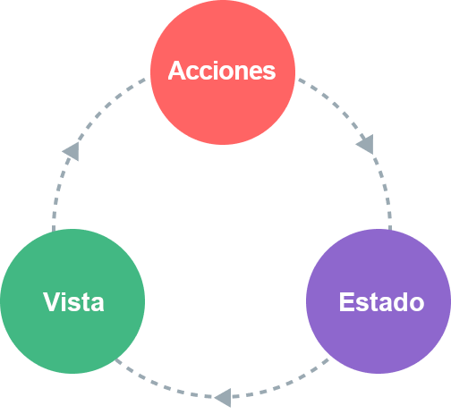

# Manejo del Estado {#state-management}

## ¿Qué es el Manejo del Estado? {#what-is-state-management}

Técnicamente, cada instancia de un componente de Vue ya "gestiona" su propio estado reactivo. Tomemos como ejemplo un simple componente contador:

<div class="composition-api">

```vue
<script setup>
import { ref } from 'vue'

// estado
const count = ref(0)

// acciones
function increment() {
  count.value++
}
</script>

<!-- vista -->
<template>{{ count }}</template>
```

</div>
<div class="options-api">

```vue
<script>
export default {
  // estado
  data() {
    return {
      count: 0
    }
  },
  // acciones
  methods: {
    increment() {
      this.count++
    }
  }
}
</script>

<!-- vista -->
<template>{{ count }}</template>
```

</div>

Esta es una unidad autónoma con las siguientes partes:

- El **estado**, la fuente de verdad que dirige nuestra aplicación.
- La **vista**, un mapeo declarativo del **estado**.
- Las **acciones**, las posibles formas en que el estado podría cambiar en reacción a las entradas del usuario desde la **vista**.

Esta es una representación sencilla del concepto de "flujo de datos en una sola dirección":

<p style="text-align: center">
  
</p>

Sin embargo, la simplicidad comienza a fallar cuando tenemos **múltiples componentes que comparten un estado común**:

1. Múltiples vistas pueden depender del mismo estado.
2. Es posible que las acciones de diferentes vistas necesiten mutar el mismo estado.

En el primer caso, una posible solución es "elevar" el estado compartido a un componente ancestro común, y luego pasarlo hacia abajo como props. Sin embargo, esto se vuelve rápidamente tedioso en árboles de componentes con jerarquías profundas, lo que lleva a otro problema conocido como [Profundización de Prop](/guide/components/provide-inject#prop-drilling).

Para el segundo caso, a menudo nos encontramos recurriendo a soluciones como alcanzar instancias directas de padre / hijo a través de refs de plantilla, o intentar mutar y sincronizar varias copias del estado a través de eventos emitidos. Ambos patrones son frágiles y conducen rápidamente a un código que no se puede mantener.

Una solución más sencilla y directa es extraer el estado compartido de los componentes y administrarlo en una única instancia global. Con esto, nuestro árbol de componentes se convierte en una gran "vista", y cualquier componente puede acceder al estado o desencadenar acciones, ¡sin importar en qué parte del árbol se encuentre!

## Gestión Sencilla del Estado con la API de Reactividad {#simple-state-management-with-reactivity-api}

<div class="options-api">

En la Options API, los datos reactivos se declaran mediante la opción `data()`. Internamente, el objeto devuelto por `data()` se vuelve reactivo a través de la función [`reactive()`](/api/reactivity-core#reactive), que también está disponible como una API pública.

</div>

Si tienes un estado que debe ser compartido por varias instancias, puedes usar [`reactive()`](/api/reactivity-core#reactive) para crear un objeto reactivo y luego importarlo en varios componentes:

```js
// store.js
import { reactive } from 'vue'

export const store = reactive({
  count: 0
})
```

<div class="composition-api">

```vue
<!-- ComponentA.vue -->
<script setup>
import { store } from './store.js'
</script>

<template>Desde A: {{ store.count }}</template>
```

```vue
<!-- ComponentB.vue -->
<script setup>
import { store } from './store.js'
</script>

<template>Desde B: {{ store.count }}</template>
```

</div>
<div class="options-api">

```vue
<!-- ComponentA.vue -->
<script>
import { store } from './store.js'

export default {
  data() {
    return {
      store
    }
  }
}
</script>

<template>Desde A: {{ store.count }}</template>
```

```vue
<!-- ComponentB.vue -->
<script>
import { store } from './store.js'

export default {
  data() {
    return {
      store
    }
  }
}
</script>

<template>Desde B: {{ store.count }}</template>
```

</div>

Ahora, cada vez que se muta el objeto `store`, tanto `<ComponentA>` como `<ComponentB>` actualizarán sus vistas automáticamente; ahora tenemos una única fuente de verdad.

Sin embargo, esto también significa que cualquier componente que importe a `store` puede mutarlo como quiera:

```vue-html{2}
<template>
  <button @click="store.count++">
    Desde B: {{ store.count }}
  </button>
</template>
```

Si bien esto funciona en casos sencillos, el estado global que puede ser mutado arbitrariamente por cualquier componente no será muy fácil de mantener a largo plazo. Para garantizar que la lógica de mutación del estado esté centralizada como el propio estado, se recomienda definir métodos en el store con nombres que expresen la intención de las acciones:

```js{6-8}
// store.js
import { reactive } from 'vue'

export const store = reactive({
  count: 0,
  increment() {
    this.count++
  }
})
```

```vue-html{2}
<template>
  <button @click="store.increment()">
    Desde B: {{ store.count }}
  </button>
</template>
```

<div class="composition-api">

[Pruébalo en la Zona de Práctica](https://play.vuejs.org/#eNrNkk1uwyAQha8yYpNEiUzXllPVrtRTeJNSqtLGgGBsVbK4ewdwnT9FWWSTFczwmPc+xMhqa4uhl6xklRdOWQQvsbfPrVadNQ7h1dCqpcYaPp3pYFHwQyteXVxKm0tpM0krnm3IgAqUnd3vUFIFUB1Z8bNOkzoVny+wDTuNcZ1gBI/GSQhzqlQX3/5Gng81pA1t33tEo+FF7JX42bYsT1BaONlRguWqZZMU4C261CWMk3EhTK8RQphm8Twse/BscoUsvdqDkTX3kP3nI6aZwcmdQDUcMPJPabX8TQphtCf0RLqd1csxuqQAJTxtYnEUGtIpAH4pn1Ou17FDScOKhT+QNAVM)

</div>
<div class="options-api">

[Pruébalo en la Zona de Práctica](https://play.vuejs.org/#eNrdU8FqhDAU/JVHLruyi+lZ3FIt9Cu82JilaTWR5CkF8d8bE5O1u1so9FYQzAyTvJnRTKTo+3QcOMlIbpgWPT5WUnS90gjPyr4ll1jAWasOdim9UMum3a20vJWWqxSgkvzTyRt+rocWYVpYFoQm8wRsJh+viHLBcyXtk9No2ALkXd/WyC0CyDfW6RVTOiancQM5ku+x7nUxgUGlOcwxn8Ppu7HJ7udqaqz3SYikOQ5aBgT+OA9slt9kasToFnb5OiAqCU+sFezjVBHvRUimeWdT7JOKrFKAl8VvYatdI6RMDRJhdlPtWdQf5mdQP+SHdtyX/IftlH9pJyS1vcQ2NK8ZivFSiL8BsQmmpMG1s1NU79frYA1k8OD+/I3pUA6+CeNdHg6hmoTMX9pPSnk=)

</div>

:::tip
Ten en cuenta que el manejador de clics usa `store.increment()` con paréntesis; esto es necesario para llamar al método en el contexto apropiado de `this`, ya que no es un método del componente.
:::

Aunque aquí estamos usando un único objeto reactivo como una store, también puedes compartir el estado reactivo creado con otras [APIs de reactividad](/api/reactivity-core), como `ref()` o `computed()`, o incluso devolver el estado global desde un [Composable](/guide/reusability/composables):

```js
import { ref } from 'vue'

// estado global, creado en el ámbito del módulo
const globalCount = ref(1)

export function useCount() {
  // estado local, creado por el componente
  const localCount = ref(1)

  return {
    globalCount,
    localCount
  }
}
```

El hecho de que el sistema de reactividad de Vue esté desacoplado del modelo del componente lo hace extremadamente flexible.

## Consideraciones sobre el SSR {#ssr-considerations}

Si estás creando una aplicación que aprovecha el [Renderizado del Lado del Servidor (SSR)](./ssr), el patrón anterior puede generar problemas debido a que el store es una única instancia compartida entre varias solicitudes. Esto se analiza con [más detalle](./ssr.html#contaminacion-del-estado-por-solicitudes-cruzadas) en la guía de SSR.

## Pinia {#pinia}

Si bien nuestra solución de administración del estado manual será suficiente en escenarios sencillos, hay muchas más cosas a considerar en aplicaciones de producción a gran escala:

- Convenciones más fuertes para la colaboración en equipo.
- Integración con las DevTools de Vue, incluyendo la línea de tiempo, la inspección dentro del componente y la depuración de la trayectoria temporal
- Reemplazo de módulos en caliente
- Soporte de Renderizado del Lado del Servidor

[Pinia](https://pinia.vuejs.org) es una librería de gestión de estados que implementa todo lo anterior. Es mantenida por el equipo central de Vue, y funciona tanto con Vue 2 como con Vue 3.

Los usuarios antiguos pueden estar familiarizados con [Vuex](https://vuex.vuejs.org/), la anterior librería oficial de gestión de estados para Vue. Con Pinia desempeñando el mismo papel en el ecosistema, Vuex está ahora en modo de mantenimiento. Todavía funciona, pero ya no recibirá nuevas características. Se recomienda utilizar Pinia para las nuevas aplicaciones.

Pinia comenzó como una exploración de cómo podría lucir la siguiente iteración de Vuex, incorporando muchas ideas de las discusiones del equipo central para Vuex 5. Finalmente, nos dimos cuenta de que Pinia ya implementa la mayor parte de lo que queríamos en Vuex 5, y decidimos que fuera la nueva recomendación.

En comparación con Vuex, Pinia proporciona una API más sencilla con menos formalidades, ofrece APIs al estilo de la Composition API y, lo que es más importante, tiene un sólido soporte de inferencia de tipos cuando se utiliza con TypeScript.
